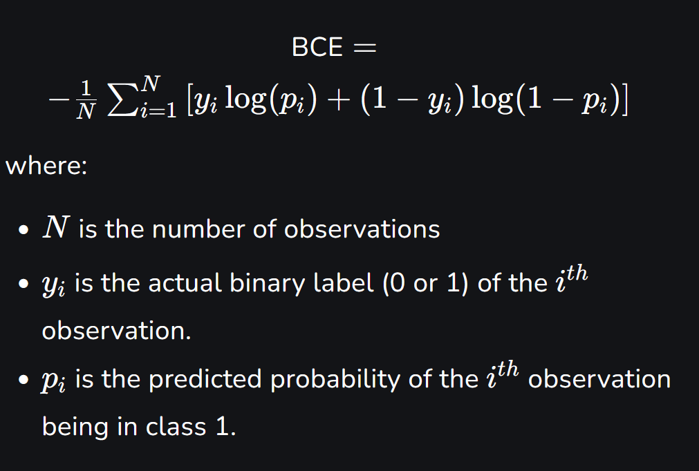

# Terms

**Binary Classification** : Is the simplest type of classification where data is divided into two possible categories. The model analyzes input features and decides which of the two classes the data belongs to. Some important aspects of binary classification are :
- **Two Classes only**: Each data point is assigned to one of the categories
- **Common exmples**: Spam vs not spam emails, diseased vs healthy patients.
- **Decision based on features**: The model uses input features to determine the correct class.

